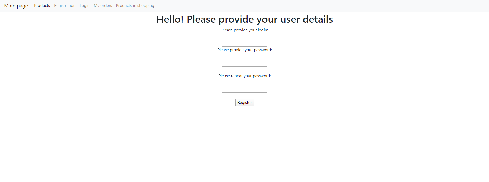

# Internet-shop

---

#### What is the goal of this project?
1. Learn a little technologies and its using
1. Learn and train how to build a project using MVC pattern
---

#### What can project provide?
* Provide good vision of project structure
* Nice technologies usement
* Good code
* An ability to start it up & configure for yourself
---

#### What technologies were used?
* TomCat
* JDBC
* Log4j
* Maven
* MySQL
---

### Project functionality:
* Authentication
* Products management
* Order management
* Authorization:

*Users with USER role will be able to:*

    - view all products
    - add to and remove products from their shopping cart
    - view shopping cart and complete order
    - view all their orders

*Users with ADMIN role will be able to*

    - add product to shop or delete it
    - see the users list
    - delete any user
    - do everything that can do simpl user
    
# How to launch it?
* Add this project to your IDE as Maven project.
* Add new Tomcat Server configuration and select war-exploded artifact to deploy. Set application context parameter to "/".
* Change path to your log file in src/main/resources/log4j2.properties on line 4. You may also want to change the 'filePattern' parameter on line 17.
* Create database with name "internet_shop" and set up connection details in src\main\java\mate\academy\shop\util\ConnectionUtil.java file 
* Then you need integrate all sql scripts from init_db.sql file which located in src\main\resources folder.
Integrate all scripts until you will see such script:

    INSERT INTO `internet_shop`.`users` (username, password) VALUES
        ('Bob', '123') 

    Check out below, what do we need other scripts for.

* And finally you can run the project via TomCat configuration but you may catch a problem with pages access at first project startup
# How to set up authorization?
Firstly you need to run the last scripts starting with: 

    INSERT INTO `internet_shop`.`users` (username, password) VALUES
        ('Bob', '123') 

End ending with:

    INSERT INTO `internet_shop`.`users_roles` (user_id, role_id) VALUES
        ((SELECT user_id from `internet_shop`.`users` WHERE username = 'Bob'),
        (SELECT role_id FROM `internet_shop`.`roles` where role_name = 'ADMIN'));
        
We need this scripts to set access for pages (Also they need refinement because of security troubles).

Now when you did everything you can log in with Bob:123 and check out all pages.
